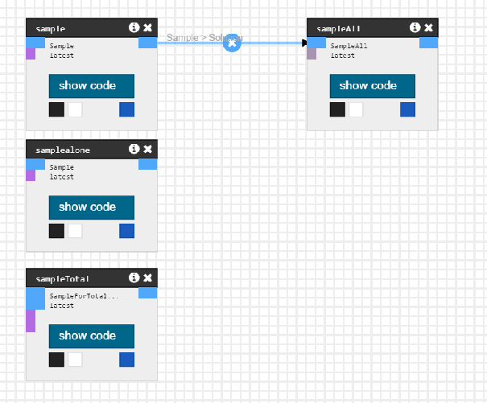
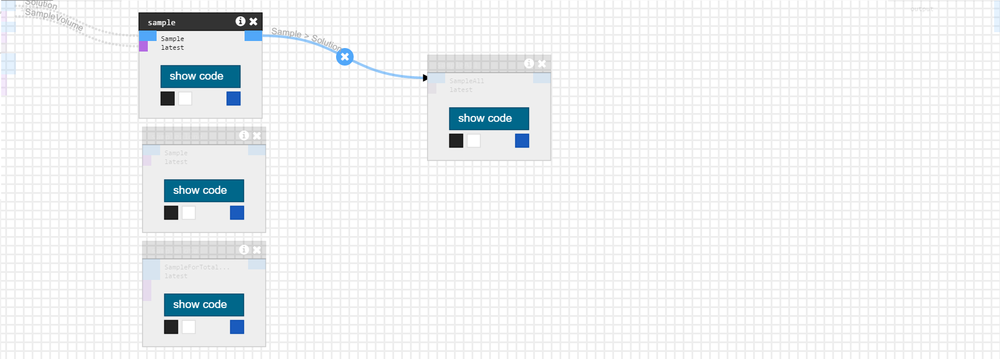
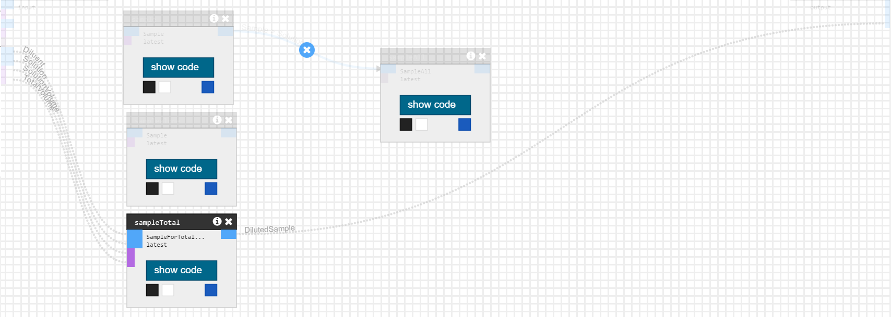

### Running Antha elements in a workflow
To run these Antha elements we need two additional files:

1. A workflow definition file (showing what elements to run)

2. A parameters file (showing what specific values to set the input variables to) 
 
This structure is designed to encourage modularity and reusability by ensuring key variables are specified at runtime rather than hardcoded in, to facilitate the rapid wiring up of workflows by allowing outputs to be fed in as inputs to other elements and to enable scalability.

### Workflow:
The workflow file specifies a set of Processes which call Antha elements 
(components) which are to be run. 
This could be: 

(Folder A) a single element run once.

(Folder B) parallel copies of a single element run in parallel, for example multiple runs of the same protocol for different samples or with different conditions.

(Folder C) multiple different elements run at the same time

(Folder C) multiple elements which may be connected; i.e. one or more outputs (ports) from a source element (src) may feed in as inputs (also ports) into the downstream target element (tgt).

The following figure shows the workflow represented by the workflow file in folder C showing 4 processes; 2 of which are connected (sample and sampleall).

### Parameters:
The parameters file assigns parameters for each of the processes specified in the workflow file

i.e. the parameters file is used to set the values for the input parameters.

In this example, the parameters for the process sample which uses the Antha element "Sample" are shown like so: 

Here we can see that there are two required inputs for this Process "Solution" and "SampleVolume" and one output of that process (also called "Sample") which is wired in as an input into the sampleAll process as the parameter "Solution".

The parameters to the parallel process "sampleTotal" are shown below: 

The example parameters files in these folders show how to set variables specified in the parameters file to the actual values we want to assign to them. Take a look at how the parameters and workflow files in folder (c) correspond to the images above.
 
One of the key variables you'll likely want to set are the liquid handling components. (wtype.LHComponent) 

### Bundle:
Instead of specifying a workflow and parameters separately a second option also exists where the workflow and parameters are combined into one file. We call this file a bundle.

This is the only valid input for use in the Antha)S

### metadata:
If a metadata.json file is added to the element folder with the element.an file. The values for the parameters specified in the metadata file will be used to prepopulate default parameters in the AnthaOS.

## Excercises

1. Define the following:

(a) element

(b) workflow

(c) parameters

(d) bundle

(e) metadata

## Next Steps

Now Move to [Folder A](Lesson1_Sample_Workflows/A_Singleelement/readme_basicCommands.md) to find out the basic Antha commands to build an run Antha elements.

